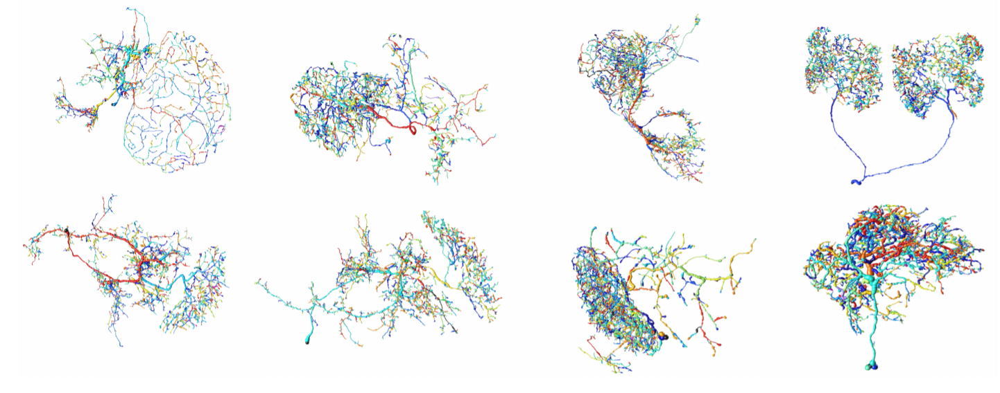

<!--
 Copyright (c) 2016, RivuletStudio, The University of Sydney, AU
 All rights reserved.

 This file is part of Rivuletpy <https://github.com/RivuletStudio/rivuletpy>

 Redistribution and use in source and binary forms, with or without
 modification, are permitted provided that the following conditions are met:

     1. Redistributions of source code must retain the above copyright
        notice, this list of conditions and the following disclaimer.
     2. Redistributions in binary form must reproduce the above copyright
        notice, this list of conditions and the following disclaimer in the
        documentation and/or other materials provided with the distribution.
     3. Neither the name of the copyright holder nor the names of
        its contributors may be used to endorse or promote products
        derived from this software without specific prior written permission.

 THIS SOFTWARE IS PROVIDED BY THE COPYRIGHT HOLDERS AND CONTRIBUTORS "AS IS" AND
 ANY EXPRESS OR IMPLIED WARRANTIES, INCLUDING, BUT NOT LIMITED TO, THE IMPLIED
 WARRANTIES OF MERCHANTABILITY AND FITNESS FOR A PARTICULAR PURPOSE ARE
 DISCLAIMED. IN NO EVENT SHALL THE COPYRIGHT HOLDER OR CONTRIBUTORS BE LIABLE FOR ANY
 DIRECT, INDIRECT, INCIDENTAL, SPECIAL, EXEMPLARY, OR CONSEQUENTIAL DAMAGES
 (INCLUDING, BUT NOT LIMITED TO, PROCUREMENT OF SUBSTITUTE GOODS OR SERVICES;
 LOSS OF USE, DATA, OR PROFITS; OR BUSINESS INTERRUPTION) HOWEVER CAUSED AND
 ON ANY THEORY OF LIABILITY, WHETHER IN CONTRACT, STRICT LIABILITY, OR TORT
 (INCLUDING NEGLIGENCE OR OTHERWISE) ARISING IN ANY WAY OUT OF THE USE OF THIS
 SOFTWARE, EVEN IF ADVISED OF THE POSSIBILITY OF SUCH DAMAGE.
 -->

# Rivuletpy-Net
## Example Neuron Tracings


## Rivuletpy == Rivulet2 
Rivuletpy is a Python3 toolkit for automatically reconstructing *multiple* neuron models from 3D microscopic image stacks & other tree structures from 3D medical images.

The project was initiated in the [BigNeuron project](https://alleninstitute.org/bigneuron/about/)

The `rtracenet` command is powered by the Rivulet2 algorithm published in IEEE Trans. TMI:

[1] S. Liu, D. Zhang, Y. Song, H. Peng and W. Cai, "Automated 3D Neuron Tracing with Precise Branch Erasing and Confidence Controlled Back-Tracking," in IEEE Transactions on Medical Imaging. URL: http://ieeexplore.ieee.org/stamp/stamp.jsp?tp=&arnumber=8354803&isnumber=4359023

PDF [https://www.biorxiv.org/content/biorxiv/early/2017/11/27/109892.full.pdf]

The predecessor Rivulet1 was published on Neuroinformatics:

[2] Siqi Liu, Donghao Zhang, Sidong Liu, Dagan Feng, Hanchuan Peng, Weidong Cai, 
"Rivulet: 3D Neuron Morphology Tracing with Iterative Back-Tracking", 
Neuroinformatics, Vol.14, Issue 4, pp387-401, 2016.

## Rivulet-net is being developed to do parallel tracing of *networks* of neurons.

## Issues / questions / pull requests

## Installation

### 0. Setup the Anaconda environment
```
$ conda create -n riv python=python3.6 anaconda # We tested on 3.5 and 3.6. Other python versions >= 3.4 should also work
$ source activate riv
```

### 1. Setup the dependencies
To install rivuletpy with pip, you need to install the following packages manually beforehand since some dependencies of rivuletpy uses them in their setup scripts
* `numpy>=1.8.0`
* `scipy>=0.17.0`
* `Cython>=0.25.1`
* `tqdm-dev`
* `libtiff-dev`
* `SimpleITK`

```
(riv)$ conda install numpy scipy matplotlib cython tqdm 
(riv)$ conda install -c conda-forge pylibtiff # Install pylibtiff for loading 3D tiff images
(riv)$ conda install -c simpleitk simpleitk  # Install SimpleITK for the support of load mhd
```

### 2. Install Up-to-date Rivuletpy from source
Optionally you can install Rivuletpy from the source files

```
(riv)$ git clone https://github.com/twhoekstra/rivuletpy
(riv)$ cd rivuletpy
(riv)$ python setup.py build
(riv)$ pip3 install .
```

This will download a simple neuron image and perform a neuron tracing with rivulet2 algorithm. If you encountered any issues while installing Rivuletpy, you are welcome to raise an issue for the developers in the [issue tracker](https://github.com/RivuletStudio/rivuletpy/issues)

## Usage
- Reconstruct multiple neurons in a single image

```python
from rivuletpy import rtracenet

if __name__ == '__main__':
    filename = r'data\3-cells.tif'
    rtracenet.trace_net(filename)

    
```

This will place the segmented images and the individual SWCs in a folder within the same 
directory named `3-cells.tif`.


## Dependencies

The build-time and runtime dependencies of Rivuletpy are:

* [numpy](http://www.numpy.org/)
* [scipy](http://www.scipy.org/)
* [Cython](http://cython.org/)
* [scikit-fmm](https://github.com/scikit-fmm)
* [scikit-image](https://github.com/scikit-image)
* [matplotlib](http://www.matplotlib.org/)
* [tqdm](https://github.com/noamraph/tqdm)
* [nibabel](http://nipy.org/nibabel/)
